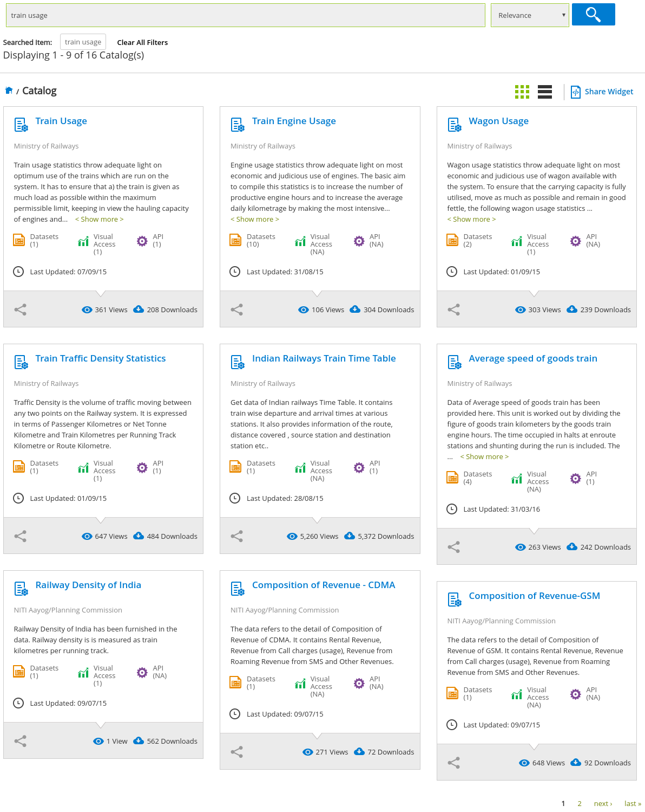
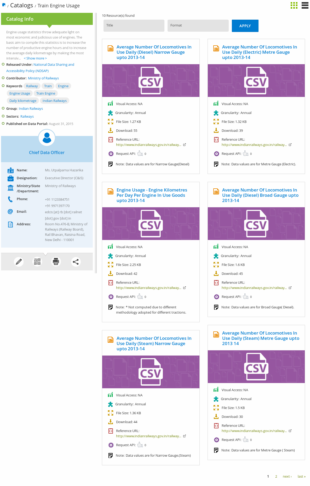

Introduction
------------

A typical search for datasets in the [Open Government Data Platform - India](https://data.gov.in) may proceed as follows. The person has a topic in mind, he enters the keywords for that topic in the search field, and clicks search. This will result in a list of catalogs related to the topic searched. The user then proceeds to click a few catalogs, and looks for the relavant datasets. Once he finds a dataset, he then will download the dataset, imports it into R, and starts the analysis.

The search functionality in this package is intended to help users by enabling the user to search for datasets directly from R. Once a particular dataset has been identified, the user can download the dataset using the `fetch_data` function if the dataset has API access. If the dataset doesn't have API access, then the user can choose among the numerous utilies that are available in the R ecosystem to download and import data.

Web flow
--------

As data.gov.in doesn't have an API endpoint to search for datasets (yet), this package uses web scraping to achieve this result. There are a number of pages and steps that a user goes through before he reaches the dataset page. It is important to know this process, to understand the various parameters of the search functionality.

### Step 1 : Catalog results

This is the result page for the search term "train usage".



As can be seen from the image, the results page contains a grid of boxes. Each box represents a catalog (or a set) of datasets. Datasets from a particular catalog generally have a common theme. Also, notice the right hand bottom corner of the page, which shows that there are more catalogs in the next page.

So, TLDR there can be multiple search pages, and each search page contains many catalogs.

### Step 2 : Datasets from a particular catalog

The following image shows the datasets from the 'Train Engine Usage' catalog. (The second catalog from the left in the previous image)



Similar to the search results page, there can be multiple pages, and each page contains multiple datasets

`search_for_datasets`
---------------------

`search_for_datasets` function takes a search term(s), parses through the search pages and then catalogs, to return a data.frame with information about the datasets.

``` r
search_for_datasets('train usage')
```

    ## 'data.frame':    11 obs. of  11 variables:
    ##  $ name       : chr  "Average Load Of Goods Trains (All Tracation) Broad Gauge and Metre Gauge upto 2013-14" "Average Number Of Locomotives In Use Daily (Diesel) Narrow Gauge upto 2013-14" "Average Number Of Locomotives In Use Daily (Electric) Metre Gauge upto 2013-14" "Engine Usage - Engine Kilometres Per Day Per Engine In Use Goods upto 2013-14" ...
    ##  $ granularity: chr  "Annual" "Annual" "Annual" "Annual" ...
    ##  $ file_size  : chr  "2.08 KB" "1.27 KB" "1.32 KB" "2.25 KB" ...
    ##  $ downloads  : num  213 55 39 42 45 44 30 16 15 20 ...
    ##  $ res_id     : chr  "a9970326-4b1a-4871-8612-5cc1a694216f" NA NA NA ...
    ##  $ csv        : chr  "https://data.gov.in/resources/average-load-goods-trains-all-tracation-broad-gauge-and-metre-gauge-upto-2013-14/download" "https://data.gov.in/resources/average-number-locomotives-use-daily-diesel-narrow-gauge-upto-2013-14/download" "https://data.gov.in/resources/average-number-locomotives-use-daily-electric-metre-gauge-upto-2013-14/download" "https://data.gov.in/resources/engine-usage-engine-kilometres-day-engine-use-goods-upto-2013-14/download" ...
    ##  $ ods        : chr  "https://data.gov.in/node/343761/datastore/export/ods" NA NA NA ...
    ##  $ xls        : chr  "https://data.gov.in/node/343761/datastore/export/xls" NA NA NA ...
    ##  $ json       : chr  "https://data.gov.in/node/343761/datastore/export/json" NA NA NA ...
    ##  $ xml        : chr  "https://data.gov.in/node/343761/datastore/export/xml" NA NA NA ...
    ##  $ jsonp      : chr  "https://data.gov.in/node/343761/datastore/export/jsonp" NA NA NA ...

This function contains five parameters in addition to the search term. These are

1.  `limit_catalog_pages`
2.  `limit_catalogs`
3.  `limit_dataset_pages`
4.  `limit_datasets`
5.  `return_catalog_list`

The first two parameters refer to the Step 1, as explained in the previous section. `limit_catalog_pages` limits the number of pages that the function will go through to get the list of catalogs. `limit_catalogs` limits the total number of catalogs parsed. These two knobs can be used independently or in combination with each other. For example, set `limit_catalog_pages` to `Inf`, and `limit_catalogs` to 25, to get 25 catalogs irrespective of the number of pages it takes to get that many catalogs.

The next two parameters refer to the Step 2. `limit_dataset_pages` limits the number of pages of datasets that the function will parse for a particular catalog. The function will stop irrespective of the remaining catalogs and pages of datasets, once the `limit_datasets` value has been reached.

``` r
search_for_datasets(search_terms = c('state', 'gdp'),
                    limit_catalog_pages = 1,
                    limit_catalogs = 3,
                    limit_dataset_pages = 2)
```

    ## 'data.frame':    12 obs. of  11 variables:
    ##  $ name       : chr  "Districtwise GDP and growth rate based at current price (1999-00) from 1999-00 to 2005-06 - Karnataka" "Districtwise GDP and growth rate based at current price (1999-00) from 1999-00 to 2007-08 - Maharashtra" "Districtwise GDP and growth rate based at current price (1999-00) from 1999-00 to 2007-08 - Meghalaya" "Districtwise GDP and growth rate based at current price (1999-00) from 1999-00 to 2007-08 - Madhya Pradesh" ...
    ##  $ granularity: chr  "Annual" "Annual" "Annual" "Annual" ...
    ##  $ file_size  : chr  "3.98 KB" "6.26 KB" "1.67 KB" "8.11 KB" ...
    ##  $ downloads  : num  152 115 103 106 98 97 87 83 81 87 ...
    ##  $ res_id     : chr  NA NA NA NA ...
    ##  $ csv        : chr  "https://data.gov.in/resources/districtwise-gdp-and-growth-rate-based-current-price-1999-00-1999-00-2005-06-karnataka/download" "https://data.gov.in/resources/districtwise-gdp-and-growth-rate-based-current-price-1999-00-1999-00-2007-08-maharashtra/download"| __truncated__ "https://data.gov.in/resources/districtwise-gdp-and-growth-rate-based-current-price-1999-00-1999-00-2007-08-meghalaya/download" "https://data.gov.in/resources/districtwise-gdp-and-growth-rate-based-current-price-1999-00-1999-00-2007-08-madhya/download" ...
    ##  $ ods        : chr  "https://data.gov.in/node/164395/datastore/export/ods" "https://data.gov.in/node/164404/datastore/export/ods" "https://data.gov.in/node/164410/datastore/export/ods" "https://data.gov.in/node/164416/datastore/export/ods" ...
    ##  $ xls        : chr  "https://data.gov.in/node/164395/datastore/export/xls" "https://data.gov.in/node/164404/datastore/export/xls" "https://data.gov.in/node/164410/datastore/export/xls" "https://data.gov.in/node/164416/datastore/export/xls" ...
    ##  $ json       : chr  "https://data.gov.in/node/164395/datastore/export/json" "https://data.gov.in/node/164404/datastore/export/json" "https://data.gov.in/node/164410/datastore/export/json" "https://data.gov.in/node/164416/datastore/export/json" ...
    ##  $ xml        : chr  "https://data.gov.in/node/164395/datastore/export/xml" "https://data.gov.in/node/164404/datastore/export/xml" "https://data.gov.in/node/164410/datastore/export/xml" "https://data.gov.in/node/164416/datastore/export/xml" ...
    ##  $ jsonp      : chr  "https://data.gov.in/node/164395/datastore/export/jsonp" "https://data.gov.in/node/164404/datastore/export/jsonp" "https://data.gov.in/node/164410/datastore/export/jsonp" "https://data.gov.in/node/164416/datastore/export/jsonp" ...

The last parameter `return_catalog_list` will enable the user to use this function to get only the list of catalogs. User can then use his judgement to choose few catalogs and then run `get_datasets_from_a_catalog` function on those catalogs to obtain the datasets.

``` r
search_for_datasets(search_terms = c('state', 'gdp'),
                    limit_catalog_pages = 2,
                    return_catalog_list = TRUE)
```

    ## 'data.frame':    18 obs. of  2 variables:
    ##  $ name: chr  "District Wise GDP and Growth Rate at Current Price(1999-2000)" "District Wise GDP and Growth Rate at Constant Price(1999-2000)" "District wise GDP and Growth Rate at Current Price(2004-05)" "District Wise GDP and Growth Rate at Constant Price(2004-05)" ...
    ##  $ link: chr  "https://data.gov.in/catalog/district-wise-gdp-and-growth-rate-current-price1999-2000" "https://data.gov.in/catalog/district-wise-gdp-and-growth-rate-constant-price1999-2000" "https://data.gov.in/catalog/district-wise-gdp-and-growth-rate-current-price2004-05" "https://data.gov.in/catalog/district-wise-gdp-and-growth-rate-constant-price2004-05" ...

`get_datasets_from_a_catalog`
-----------------------------

Use this function to get the list of datasets from a particular catalog.

``` r
get_datasets_from_a_catalog(
  'https://data.gov.in/catalog/session-wise-statistical-information-relating-questions-rajya-sabha',
  limit_dataset_pages = 7, limit_datasets = 10)
```

    ## 'data.frame':    12 obs. of  11 variables:
    ##  $ name       : chr  "Notices of Starred and Unstarred Questions received for each date after the issue of Bulletin for commencement of the Session d"| __truncated__ "Statistical abstract relating to Questions (Starred and Unstarred) showing the number of notices received in respect of each Mi"| __truncated__ "Total number of notices of Starred and Unstarred Questions received under each Group during Rajya Sabha Session 220 (July to Au"| __truncated__ "Abstract showing disposal of notices of Starred and Unstarred Questions during Rajya Sabha Session 220 (July to August 2010)" ...
    ##  $ granularity: chr  "Others" "Others" "Others" "Others" ...
    ##  $ file_size  : chr  "1.07 KB" "4.85 KB" "1.27 KB" "238 bytes" ...
    ##  $ downloads  : num  6 2 2 3 2 2 0 1 1 1 ...
    ##  $ res_id     : chr  NA NA NA NA ...
    ##  $ csv        : chr  "https://data.gov.in/resources/notices-starred-and-unstarred-questions-received-each-date-after-issue-bulletin-3/download" "https://data.gov.in/resources/statistical-abstract-relating-questions-starred-and-unstarred-showing-number-notices-4/download" "https://data.gov.in/resources/total-number-notices-starred-and-unstarred-questions-received-under-each-group-during-5/download" "https://data.gov.in/resources/abstract-showing-disposal-notices-starred-and-unstarred-questions-during-rajya-sabha-5/download" ...
    ##  $ ods        : chr  NA NA NA NA ...
    ##  $ xls        : chr  NA NA NA NA ...
    ##  $ json       : chr  NA NA NA NA ...
    ##  $ xml        : chr  NA NA NA NA ...
    ##  $ jsonp      : chr  NA NA NA NA ...
